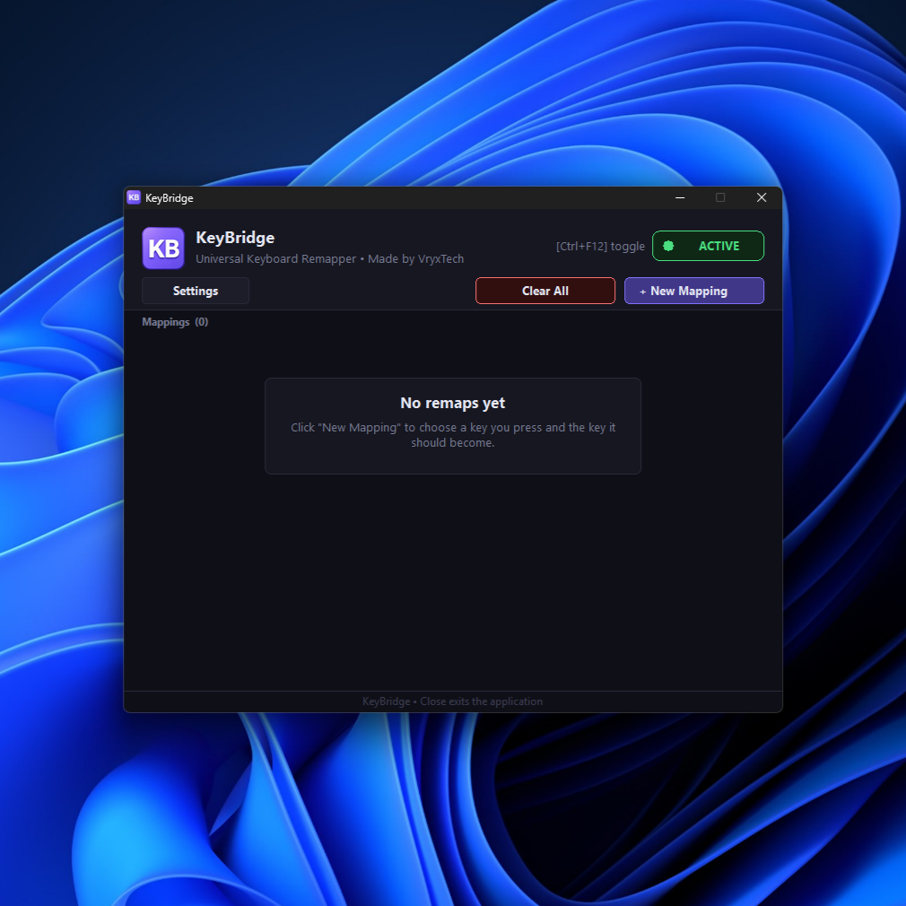

<div align="center">

# KeyBridge

### ⚡ Native Performance • 🎯 Modern Experience

*A lightweight, modern keyboard remapper for Windows built with native Win32 C++.*


</div>

<p align="center">
    
</p>

---

# 🚀 Overview

**KeyBridge** is a lightweight and modern keyboard remapper built exclusively for Windows.

Built entirely with native Win32 C++, KeyBridge delivers a fast, responsive, and seamless experience without relying on external frameworks, additional runtimes, or third-party dependencies.

Designed with performance, simplicity, and native Windows integration in mind, it offers an intuitive user experience while maintaining an exceptionally small resource footprint.

---

# ✨ Features

### ⌨️ Core

* Persistent keyboard remapping
* Simple two-step key mapping workflow
* Automatic configuration saving
* Fast and intuitive workflow

### 🎨 User Experience

* Modern native Win32 interface
* Clean and responsive design
* System tray integration
* Start with Windows support
* DPI-aware interface

### ⚡ Performance

| Metric            |   Value |
| ----------------- | ------: |
| Executable Size   | ~2.2 MB |
| Idle Memory Usage |   <7 MB |
| Idle CPU Usage    |     ~0% |
| Startup Time      | Instant |
| Dependencies      |    None |

---

# 📦 Requirements

To build KeyBridge from source, make sure you have the following installed:

* Windows 10 or later
* **MinGW-w64** with C++17 support
* The **MinGW-w64 `bin` folder** added to your system **PATH**

If the `g++` command works from Command Prompt or PowerShell, your environment is configured correctly.

---

# 🛠️ Building

1. Clone the repository:

```bash
git clone https://github.com/VryxTech/KeyBridge.git
```

2. Open the project folder.

3. Run:

```bat
build.bat
```

The build script will automatically:

* Compile all source files
* Compile the Windows resources
* Link the required Windows libraries
* Apply release optimizations
* Generate **KeyBridge.exe**

No IDE or manual project configuration is required.

---

# 🚀 Running

After the build completes successfully:

* Locate **KeyBridge.exe** inside the project directory.
* Double-click the executable to launch the application.

No installation or additional runtime dependencies are required.

---

# 🤝 Contributing

Contributions, suggestions, and bug reports are welcome.

If you discover a bug or have an idea that could improve KeyBridge, feel free to open an **Issue** or submit a **Pull Request**.

---

# 📄 License

This project is licensed under the **MIT License**.

---

<div align="center">

**Built with Modern C++ & Native Win32 API**

Developed by **VryxTech**

</div>
